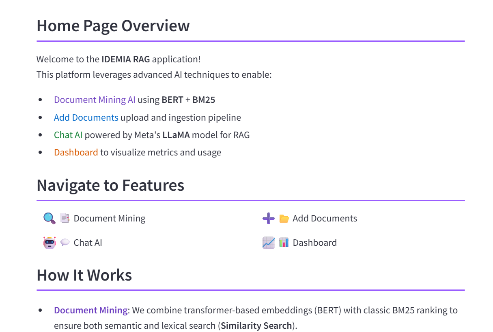
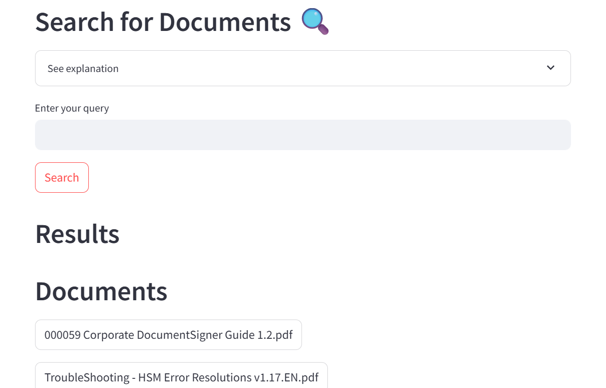
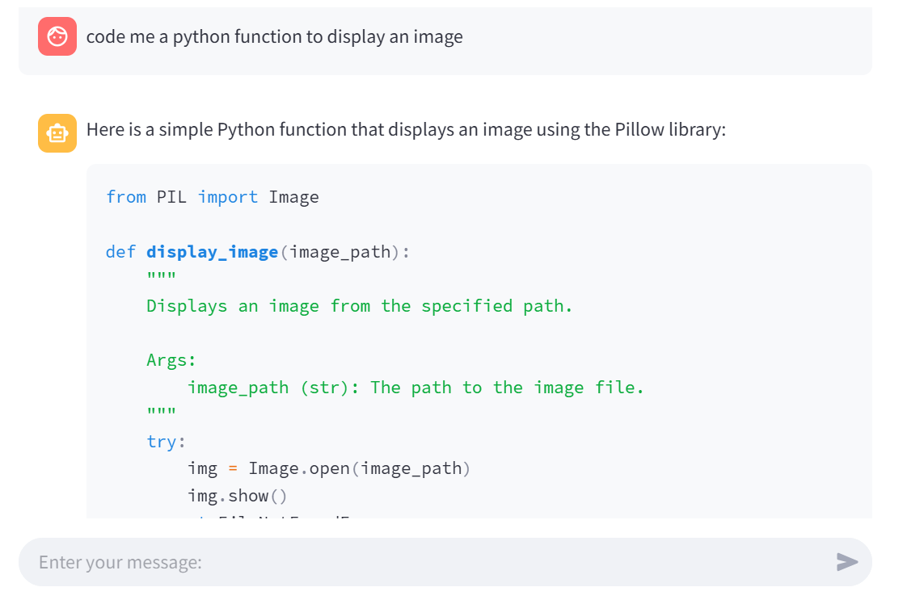

# IDEMIA RAG – Plate‑forme de Recherche Augmentée par les Documents 📚🤖

Une application complète alliant **extraction de connaissances** et **génération de réponses** à partir de vos documents :  
- **Document Mining** (BERT + BM25) pour la recherche sémantique et lexicale  
- **Upload & Ingestion** automatique de PDF  
- **Chat AI** propulsé par le modèle LLaMA pour le RAG  
- **Dashboard** de suivi d’usage et de performances  

---


---

## 🛠️ Technologies utilisées

- **Python 3.10+**
- **Streamlit** – interface utilisateur interactive
- **FastAPI** – backend REST / WebSocket
- **Chroma** – base vectorielle persistante
- **Redis** – cache & file de messages
- **Sentence‑Transformers** (BERT *all‑mpnet‑base‑v2*) – embeddings
- **LLaMA** – modèle de génération (GGUF quantized)
- **LangChain** – orchestration RAG
- **FAISS** – indexation haute performance (optionnel)
- **Docker** / **Poetry** – conteneurisation & gestion des dépendances (facultatif)

## 🚀 Mise en route rapide

```bash
# 1) Cloner le dépôt
git clone <votre‑repo>.git
cd <votre‑repo>

# 2) Créer un environnement virtuel (optionnel mais recommandé)
python -m venv .venv
source .venv/bin/activate           # Sous Windows : .venv\Scripts\activate

# 3) Installer les dépendances Python
pip install -r requirements.txt
```

---

## 🐘 Installation de Redis

| Plate‑forme | Commandes |
|-------------|-----------|
| **Ubuntu / Debian** | ```bash<br>sudo apt update<br>sudo apt install redis-server<br>``` |
| **macOS (Homebrew)** | ```bash<br>brew install redis<br>brew services start redis<br>``` |
| **Windows** | Téléchargez le binaire depuis [Memurai](https://www.memurai.com/download) ou [MSOpenTech](https://github.com/microsoftarchive/redis/releases) et démarrez `redis-server.exe`. |

**Lancement manuel** :

```bash
# Au besoin, dans un terminal séparé
redis-server
```

---

## ⚙️ Démarrage des services applicatifs

Ouvrez **trois** terminaux (ou onglets / panneaux tmux) dans le dossier racine :

| Terminal | Commande | Description |
|----------|----------|-------------|
| 1 | ```bash<br>chroma run --path ./chroma_langchain_db --port 8010``` | Lance la base vectorielle **Chroma** |
| 2 | ```bash<br>uvicorn fast_api_app:app --host 0.0.0.0 --port 8000 --workers 1``` | Démarre l’API **FastAPI** |
| 3 | ```bash<br>streamlit run streamlit_app.py --browser.serverAddress localhost``` | Lance l’interface **Streamlit** |

> **Astuce :** vous pouvez utiliser `tmux` ou `foreman` pour lancer tous les services dans une seule fenêtre.

---

## 🖼️ Aperçu de l’application

| Home Page | Recherche de documents | Chat AI |
|-----------|-----------------------|---------|
|  |  |  |

---

## 📂 Arborescence essentielle

```
.
├── data/                 # PDF sources
├── preprocessed_data/    # Textes segmentés & index FAISS
├── models/               # Modèles BERT & LLaMA
├── images/               # Logos & captures d’écran
├── streamlit_app.py      # UI Streamlit
├── fast_api_app.py       # Backend FastAPI
└── README.md
```

---

## 📝 Licence

Distribué sous licence **MIT** – voir le fichier `LICENSE` pour plus de détails.

---

## 🤝 Contribuer

Les PR sont les bienvenues ! Merci de respecter le style de code *Black* / *isort* et de documenter vos ajouts.

